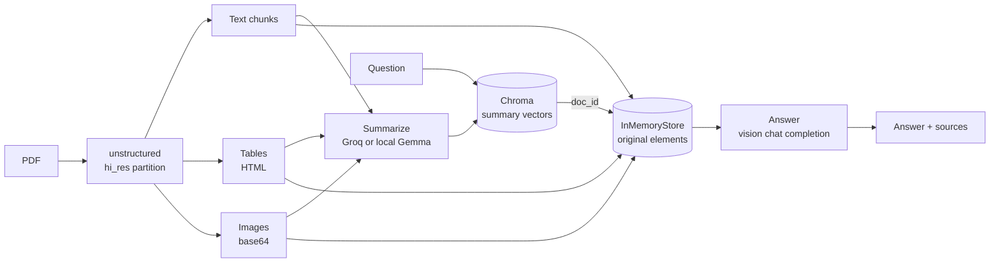

# DocuMind

A multimodal Retrieval-Augmented Generation app for PDFs. DocuMind extracts **text, tables, and images** from a document, summarizes each element with a vision-language model, indexes those summaries in a vector store, and answers questions against the retrieved originals — including the figures and tables, not just the prose.

---

## Why a multi-vector index

A plain RAG pipeline embeds raw chunks, which works badly for tables (HTML noise) and not at all for images. DocuMind embeds a *summary* of every element while keeping the original element in a separate docstore:



Search happens over clean, dense summaries; generation happens over the full original content. The two halves are linked by a deterministic `doc_id` (a SHA-256 of source file, modality, chunk index, and content), so the same PDF always produces the same IDs and evaluation labels stay reusable across runs.

---

## Features

- **PDF ingestion** with `unstructured`'s `hi_res` strategy — table structure inference and image block extraction to base64.
- **Swappable model backend** — Groq (`qwen/qwen3.6-27b` for vision, `openai/gpt-oss-20b` for text) by default, or local Gemma 3 (`google/gemma-3-4b-it`) for offline and Kaggle runs.
- **Multi-vector retrieval** — Chroma for summary embeddings (`all-MiniLM-L6-v2`), an in-memory docstore for originals.
- **Two answer modes** in the UI — answer only, or answer plus the text and image sources that produced it.
- **Source-traceable metadata** — every indexed element carries `source_id`, `source_file`, `page_number`, `modality`, and `chunk_index`.
- **Graceful degradation** — with no `GROQ_API_KEY`, the Groq wrapper returns a context-grounded offline response instead of crashing.
- **Reproducible evaluation harness** reporting Hit@k, Recall@k, Precision@k, required-term coverage, and per-stage latency.

---

## Repository layout

```
extraction/extract_pdf.py        # unstructured partition_pdf -> chunked elements
inference.py                     # backend router: Groq or local Gemma, one shared API
local_model.py                   # Gemma 3 loading, text/image summarization, local answering
summarization/                   # thin summarization wrappers used by the pipeline
rag/vector_store.py              # Chroma + HuggingFace embeddings
rag/retrieval.py                 # MultiVectorRetriever, deterministic doc_id + source metadata
rag/rag_chain.py                 # prompt construction, answer chain, source-returning chain
groq_api.py                      # Groq chat-completions client with offline fallback
frontend/display.py              # Streamlit UI
packages.txt / .streamlit/       # deployment configuration
main.py                          # end-to-end CLI run over data/attention.pdf
evaluation/                      # labelled JSONL cases + evaluate_rag.py
```

---

## Setup

### Requirements

- Python 3.11
- System packages for `unstructured`'s high-resolution parser:

```bash
# Fedora
sudo dnf install poppler-utils tesseract libmagic
# Debian/Ubuntu
sudo apt install poppler-utils tesseract-ocr libmagic-dev
```

### Install

```bash
git clone https://github.com/manish-01882/docu_mind.git
cd docu_mind
python -m venv .venv && source .venv/bin/activate
pip install -r requirements.txt
```

### Configure

Create a `.env` file in the project root:

```bash
GROQ_API_KEY=your_groq_key    # summarization and answering
```

A Groq key is all the app needs — no GPU and no model download. Get one free at [console.groq.com](https://console.groq.com/keys). Without it the app still runs, but answers come from a limited offline fallback and a banner says so.

To run fully offline instead, set `SUMMARIZER_BACKEND=local` and point `LOCAL_MODEL_PATH` at downloaded Gemma 3 weights. Gemma 3 is gated, so accept the license on Hugging Face first. A GPU is strongly recommended for that path.

| Variable | Purpose | Default |
| --- | --- | --- |
| `GROQ_API_KEY` | Groq summarization and answering | unset → offline fallback |
| `SUMMARIZER_BACKEND` | Force `groq` or `local` | auto: `local` only if a model path is set |
| `KAGGLE_MODEL_PATH` / `LOCAL_MODEL_PATH` | Local Gemma weights directory | — |
| `LOCAL_MODEL_ID` | Hugging Face model ID | `google/gemma-3-4b-it` |
| `LOCAL_MAX_CONTEXT_CHARS` | Character budget for answer context | `16000` |
| `LOCAL_MAX_CONTEXT_IMAGES` | Images passed to the answer model | `2` |
| `UNSTRUCTURED_STRATEGY` | PDF parse strategy (`hi_res` or `fast`) | `hi_res` |

---

## Usage

### Streamlit app

```bash
streamlit run frontend/display.py
```

Upload a PDF, pick **Only response** or **Response and source**, and ask a question. With no PDF uploaded, the app answers directly from the model using the last ten messages of chat history as context.

### Command line

```bash
python main.py
```

Runs the full pipeline over `data/attention.pdf` and prints the answer — useful for verifying an install end to end.

### Docker

```bash
docker build -t documind .
docker run -p 8501:8501 --env-file .env documind
```

---

## Deployment

DocuMind deploys to **Streamlit Community Cloud** on the free tier. Because summarization and answering both run through Groq, the host only needs CPU.

The repository already contains everything the platform reads:

| File | Purpose |
| --- | --- |
| `requirements.txt` | Python dependencies, with torch pinned to the CPU wheel |
| `packages.txt` | apt packages that `unstructured` needs, including the OpenCV shared libraries (`libgl1`, `libglib2.0-0`) that are absent from the Streamlit Cloud image |
| `.streamlit/config.toml` | theme and a 15 MB upload cap |

### Steps

1. Push to GitHub:

   ```bash
   git add -A && git commit -m "Prepare for deployment" && git push
   ```

2. Go to [share.streamlit.io](https://share.streamlit.io) and click **Create app**, then select this repository.

3. Set the main file path to `frontend/display.py` and, under **Advanced settings**, choose **Python 3.11**.

4. Still under **Advanced settings**, paste into **Secrets**:

   ```toml
   GROQ_API_KEY = "your_groq_api_key_here"
   ```

   See `.streamlit/secrets.toml.example`. Secrets are read through `st.secrets` and never committed.

5. Click **Deploy**. The first build takes several minutes because `unstructured` and torch are large.

### Notes and limits

- **`ImportError: libGL.so.1`** means `packages.txt` was not applied. `unstructured[pdf]` pulls in OpenCV, which needs system libraries the Streamlit Cloud image does not ship. Confirm `packages.txt` is committed, then reboot the app so apt runs again.
- **Groq rate limits (HTTP 429).** Indexing issues one API call per extracted element, and the free tier allows roughly 30 requests per minute, so a long PDF will hit the limit. Requests retry automatically with backoff, honouring Groq's `retry-after` header. Elements that still fail are left out of the index and the app says how many — wait a minute and re-upload for full coverage, or raise the limit on a paid Groq tier.
- **First upload is slow.** `hi_res` parsing downloads layout-detection models on first use, then runs them on CPU. Expect a minute or more for a long PDF.
- **If the app runs out of memory**, add `UNSTRUCTURED_STRATEGY = "fast"` to Secrets. Parsing gets much lighter, at the cost of table structure and image extraction.
- **Nothing persists.** The Chroma collection is in-memory, so every restart re-indexes. Community Cloud also sleeps idle apps.
- **Keep uploads small.** The 15 MB cap in `.streamlit/config.toml` exists because a `hi_res` parse holds the whole document in memory.

---

## Evaluation

The harness reuses the production extraction, summarization, indexing, and answer code — it is not a mock benchmark. Cases are one JSON object per line:

```json
{
  "id": "attention-self-attention",
  "document": "data/attention.pdf",
  "question": "What does self-attention allow each token to do?",
  "expected_sources": [{"source_file": "data/attention.pdf", "page_number": 1, "modality": "text"}],
  "reference_answer": "Each token can weigh the relevance of other tokens in the sequence.",
  "required_terms": ["token", "attention"]
}
```

```bash
# validate the case file without loading models
python evaluation/evaluate_rag.py --cases evaluation/attention_cases.jsonl --validate-only

# retrieval only — fast iteration on chunking, summaries, embeddings
python evaluation/evaluate_rag.py --cases evaluation/attention_cases.jsonl \
  --top-k 1,3,5 --skip-answers --output evaluation/results/retrieval.json

# full run including generated answers
python evaluation/evaluate_rag.py --cases evaluation/attention_cases.jsonl \
  --top-k 1,3,5 --answer-k 5 --output evaluation/results/baseline.json
```

Reported metrics: **Hit@k** (a labelled source appeared in the top *k*), **Recall@k**, **Precision@k**, **required-term coverage**, and ingestion/retrieval/answer latency.

Required-term coverage is a transparent automated proxy, not a correctness measure. Answer quality still needs human review, or an LLM judge such as RAGAS or DeepEval once the dataset is stable.

Results are written to `evaluation/results/`, which is gitignored.

See [`evaluation/README.md`](evaluation/README.md) for the labelling workflow and [`evaluation/KAGGLE.md`](evaluation/KAGGLE.md) for running the benchmark on a Kaggle GPU session.

---

## Current limitations

- The Chroma collection and the docstore are **in-memory**; every app restart re-ingests the PDF from scratch.
- Ingestion is slow. `hi_res` parsing plus one model call per extracted element dominates the wall clock on a first upload.
- Summaries are generated one element at a time, so a long PDF makes many sequential API calls.
- Answer quality depends on the Groq models; the offline fallback is a diagnostic aid, not a real answer path.

See [`PROJECT_REPORT.md`](PROJECT_REPORT.md) for a deeper architectural review and the prioritized remediation plan.
