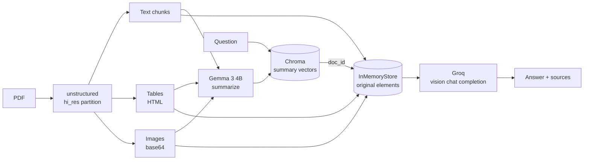

# DocuMind

A multimodal Retrieval-Augmented Generation app for PDFs. DocuMind extracts **text, tables, and images** from a document, summarizes each element with a local vision-language model, indexes those summaries in a vector store, and answers questions against the retrieved originals — including the figures and tables, not just the prose.

---

## Why a multi-vector index

A plain RAG pipeline embeds raw chunks, which works badly for tables (HTML noise) and not at all for images. DocuMind embeds a *summary* of every element while keeping the original element in a separate docstore:



Search happens over clean, dense summaries; generation happens over the full original content. The two halves are linked by a deterministic `doc_id` (a SHA-256 of source file, modality, chunk index, and content), so the same PDF always produces the same IDs and evaluation labels stay reusable across runs.

---

## Features

- **PDF ingestion** with `unstructured`'s `hi_res` strategy — table structure inference and image block extraction to base64.
- **Multimodal summarization** via local Gemma 3 (`google/gemma-3-4b-it`) for text chunks, HTML tables, and images.
- **Multi-vector retrieval** — Chroma for summary embeddings (`all-MiniLM-L6-v2`), an in-memory docstore for originals.
- **Two answer modes** in the UI — answer only, or answer plus the text and image sources that produced it.
- **Source-traceable metadata** — every indexed element carries `source_id`, `source_file`, `page_number`, `modality`, and `chunk_index`.
- **Graceful degradation** — with no `GROQ_API_KEY`, the Groq wrapper returns a context-grounded offline response instead of crashing.
- **Reproducible evaluation harness** reporting Hit@k, Recall@k, Precision@k, required-term coverage, and per-stage latency.

---

## Repository layout

```
extraction/extract_pdf.py        # unstructured partition_pdf -> chunked elements
local_model.py                   # Gemma 3 loading, text/image summarization, local answering
summarization/                   # thin summarization wrappers used by the pipeline
rag/vector_store.py              # Chroma + HuggingFace embeddings
rag/retrieval.py                 # MultiVectorRetriever, deterministic doc_id + source metadata
rag/rag_chain.py                 # prompt construction, answer chain, source-returning chain
groq_api.py                      # Groq chat-completions client with offline fallback
frontend/display.py              # Streamlit UI
main.py                          # end-to-end CLI run over data/attention.pdf
evaluation/                      # labelled JSONL cases + evaluate_rag.py
```

---

## Setup

### Requirements

- Python 3.11
- System packages for `unstructured`'s high-resolution parser:

```bash
# Fedora
sudo dnf install poppler-utils tesseract libmagic
# Debian/Ubuntu
sudo apt install poppler-utils tesseract-ocr libmagic-dev
```

### Install

```bash
git clone https://github.com/manish-01882/docu_mind.git
cd docu_mind
python -m venv .venv && source .venv/bin/activate
pip install -r requirements.txt
```

### Configure

Create a `.env` file in the project root:

```bash
GROQ_API_KEY=your_groq_key           # answer generation; omit to use the offline fallback
LOCAL_MODEL_PATH=/path/to/gemma-3-4b-it   # or LOCAL_MODEL_ID=google/gemma-3-4b-it
```

Gemma 3 is gated. Either download the weights locally and point `LOCAL_MODEL_PATH` at the directory, or set `LOCAL_MODEL_ID` and authenticate with Hugging Face after accepting the license. Summarization needs this model; a GPU is strongly recommended, though it will run on CPU in float32.

| Variable | Purpose | Default |
| --- | --- | --- |
| `GROQ_API_KEY` | Groq answer generation | unset → offline fallback |
| `KAGGLE_MODEL_PATH` / `LOCAL_MODEL_PATH` | Local Gemma weights directory | — |
| `LOCAL_MODEL_ID` | Hugging Face model ID | `google/gemma-3-4b-it` |
| `LOCAL_MAX_CONTEXT_CHARS` | Character budget for answer context | `16000` |
| `LOCAL_MAX_CONTEXT_IMAGES` | Images passed to the answer model | `2` |

---

## Usage

### Streamlit app

```bash
streamlit run frontend/display.py
```

Upload a PDF, pick **Only response** or **Response and source**, and ask a question. With no PDF uploaded, the app answers directly from Groq using the last ten messages of chat history as context.

### Command line

```bash
python main.py
```

Runs the full pipeline over `data/attention.pdf` and prints the answer — useful for verifying an install end to end.

### Docker

```bash
docker build -t documind .
docker run -p 8501:8501 --env-file .env documind
```

---

## Evaluation

The harness reuses the production extraction, summarization, indexing, and answer code — it is not a mock benchmark. Cases are one JSON object per line:

```json
{
  "id": "attention-self-attention",
  "document": "data/attention.pdf",
  "question": "What does self-attention allow each token to do?",
  "expected_sources": [{"source_file": "data/attention.pdf", "page_number": 1, "modality": "text"}],
  "reference_answer": "Each token can weigh the relevance of other tokens in the sequence.",
  "required_terms": ["token", "attention"]
}
```

```bash
# validate the case file without loading models
python evaluation/evaluate_rag.py --cases evaluation/attention_cases.jsonl --validate-only

# retrieval only — fast iteration on chunking, summaries, embeddings
python evaluation/evaluate_rag.py --cases evaluation/attention_cases.jsonl \
  --top-k 1,3,5 --skip-answers --output evaluation/results/retrieval.json

# full run including generated answers
python evaluation/evaluate_rag.py --cases evaluation/attention_cases.jsonl \
  --top-k 1,3,5 --answer-k 5 --output evaluation/results/baseline.json
```

Reported metrics: **Hit@k** (a labelled source appeared in the top *k*), **Recall@k**, **Precision@k**, **required-term coverage**, and ingestion/retrieval/answer latency.

Required-term coverage is a transparent automated proxy, not a correctness measure. Answer quality still needs human review, or an LLM judge such as RAGAS or DeepEval once the dataset is stable.

Results are written to `evaluation/results/`, which is gitignored. For reference, a local run over the 14-case *Attention Is All You Need* set produced Hit@1 0.21, Hit@3 0.50, Hit@5 0.64 — a baseline to improve against, not a headline number.

See [`evaluation/README.md`](evaluation/README.md) for the labelling workflow and [`evaluation/KAGGLE.md`](evaluation/KAGGLE.md) for running the benchmark on a Kaggle GPU session.

---

## Current limitations

- The Chroma collection and the docstore are **in-memory**; every app restart re-ingests the PDF from scratch.
- Ingestion is slow. `hi_res` parsing plus one Gemma call per element dominates the wall clock on a first upload.
- Uploading a second PDF in the same session does not reset the retriever — restart the app to switch documents.
- Summarization runs locally while answer generation calls Groq, so the pipeline depends on both a local GPU-class model and a hosted API.

See [`PROJECT_REPORT.md`](PROJECT_REPORT.md) for a deeper architectural review and the prioritized remediation plan.
